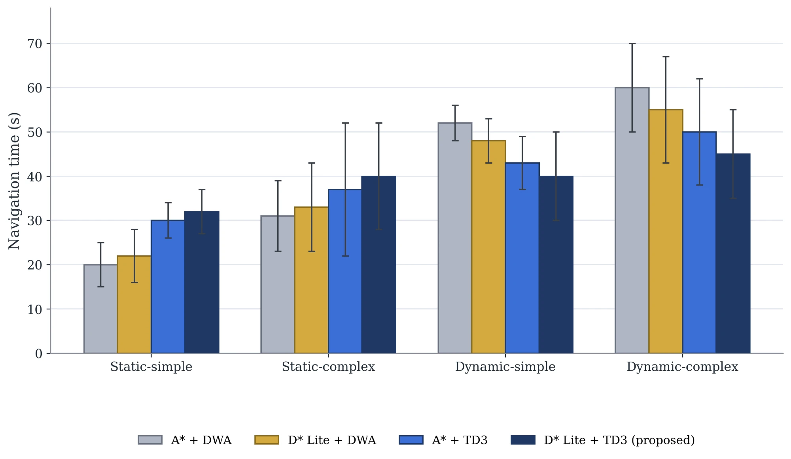
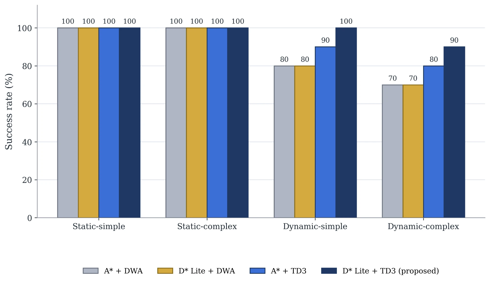

# hybrid-dstar-lite-td3-navigation

Hybrid mobile-robot navigation for [ROS 2 Nav2](https://docs.nav2.org/) (Humble): a classical **D\* Lite global planner** combined with a **TD3 deep-reinforcement-learning local controller**.

- **Global planning (D\* Lite):** searches the global costmap for the overall path from start to goal.
- **Local control (TD3):** a learned policy follows that path, steering from LiDAR readings to avoid static and dynamic obstacles in real time.

This combination of a traditional planner with a learned controller is the subject of my M.Sc. research on hybrid path planning for mobile robots.

| Component | Repository |
|---|---|
| D\* Lite global planner plugin | [nav2-dstar-lite-planner](https://github.com/mohamed-aly-abdelghafar/nav2-dstar-lite-planner) |
| TD3 local controller plugin | [nav2-td3-controller](https://github.com/mohamed-aly-abdelghafar/nav2-td3-controller) |
| Nav2 configuration, launch files, test environments, results | this repository |

## Results

Comparison of four global-planner / local-planner combinations across four scenarios (static or dynamic obstacles, simple or complex environment). **D\* Lite + TD3** is the proposed method; the baselines are A\* or D\* Lite with DWA, and A\* with TD3.

**Navigation time** (seconds, lower is better)



**Success rate** (%, higher is better)



What the results show:

- **Dynamic environments:** D\* Lite + TD3 is the fastest and the most reliable. Success rate is 100% in dynamic-simple (baselines 80-90%) and 90% in dynamic-complex (baselines 70-80%), and navigation time is about 12 s shorter in dynamic-simple and 15 s shorter in dynamic-complex than A\* + DWA.
- **Static environments:** every method reaches the goal 100% of the time, but the TD3-based methods are slower than the DWA baselines (for example 20 s for A\* + DWA against 32 s for D\* Lite + TD3 in static-simple). The advantage of the proposed method appears once obstacles move.

## Quick start (simulation)

Requirements: Ubuntu 22.04, ROS 2 Humble, Nav2, TurtleBot3 simulation packages, Gazebo (classic) with its development files, PyTorch.

```bash
sudo apt install ros-humble-navigation2 ros-humble-nav2-bringup ros-humble-turtlebot3-gazebo ros-humble-gazebo-ros-pkgs ros-humble-gazebo-dev
pip install torch numpy
```

Build the three repositories in one workspace:

```bash
mkdir -p ~/hybrid_ws/src && cd ~/hybrid_ws/src
git clone https://github.com/mohamed-aly-abdelghafar/nav2-dstar-lite-planner.git
git clone https://github.com/mohamed-aly-abdelghafar/nav2-td3-controller.git
git clone https://github.com/mohamed-aly-abdelghafar/hybrid-dstar-lite-td3-navigation.git
cd ~/hybrid_ws
rosdep install --from-paths src --ignore-src -y
colcon build
source install/setup.bash
```

Launch TurtleBot3 in Gazebo with Nav2 using the D\* Lite planner and TD3 controller. The `environment` argument selects the test environment (see below):

```bash
ros2 launch hybrid_navigation hybrid_simulation_launch.py environment:=dynamic_complex
```

The robot starts at the environment's default spawn pose and AMCL is initialised there, so in RViz you only need to send a goal with **Nav2 Goal**. Without RViz (for example on a server), run headless and use the command line:

```bash
ros2 launch hybrid_navigation hybrid_simulation_launch.py environment:=dynamic_complex headless:=True use_rviz:=False

# in a second terminal
ros2 action send_goal /navigate_to_pose nav2_msgs/action/NavigateToPose   "{pose: {header: {frame_id: map}, pose: {position: {x: 3.5, y: -0.5}, orientation: {w: 1.0}}}}"
```

`scripts/smoke_test.sh <environment>` automates this: it starts a headless simulation, sends one goal and prints `PASS` or `FAIL`.

Launch arguments: `environment`, `headless` (no Gazebo window), `use_rviz`, `x_pose` / `y_pose` (spawn position; the default depends on the environment) and `model_path` (TD3 actor weights).

If you are offline, Gazebo can hang while it tries to reach its online model database; the launch file already disables that lookup.

## Test environments

Four environments, matching the scenarios in the results above. The robot is a TurtleBot3 Burger in all of them.

| `environment:=` | Scenario | World | Default spawn |
|---|---|---|---|
| `static_simple` | Static Simple | TurtleBot3 DQN stage 2: 4 m square arena, 4 static pillars (`turtlebot3_gazebo`) | (0, 0) |
| `static_complex` | Static Complex | TurtleBot3 world: hexagonal arena, 9 static pillars (`turtlebot3_gazebo`) | (-2.0, -0.5) |
| `dynamic_simple` | Dynamic Simple | `worlds/dynamic_simple.world`: TurtleBot3 DQN stage 4, 4 m square arena, 7 inner walls, 2 moving obstacles | (0, 0) |
| `dynamic_complex` | Dynamic Complex | `worlds/dynamic_complex.world`: 10 m square arena, 8 internal walls, 8 moving obstacles | (-2.0, -0.5) |

Switch environments by changing the argument:

```bash
ros2 launch hybrid_navigation hybrid_simulation_launch.py environment:=static_simple
ros2 launch hybrid_navigation hybrid_simulation_launch.py environment:=static_complex
ros2 launch hybrid_navigation hybrid_simulation_launch.py environment:=dynamic_simple
ros2 launch hybrid_navigation hybrid_simulation_launch.py environment:=dynamic_complex
```

Stop the previous simulation before starting another one (two Gazebo servers cannot run at once).

**Maps.** Each environment has a Nav2 map in the Gazebo world frame (`maps/`), drawn from the world's wall and pillar geometry at 0.05 m per cell, so the map and the world share one coordinate system and the spawn pose is the AMCL start pose. `static_complex` uses the standard `turtlebot3_world` map from `nav2_bringup`. The moving obstacles are not in the maps; they appear only in the LiDAR scans.

**Moving obstacles.** `libpatrol_obstacle.so` (`plugins/patrol_obstacle.cc`, built with this package) moves a model along a looping trajectory given as offsets from its spawn pose. The official TurtleBot3 obstacle plugins used by DQN stage 4 are not installed by the `turtlebot3_gazebo` package, so `dynamic_simple.world` plays the same trajectories through this plugin. In `dynamic_complex.world` the 8 obstacles patrol straight lines between fixed points, each with its own period (16 to 28 s per round trip), and the lines do not cross walls or each other.

## Run on a robot

`hybrid_navigation_launch.py` starts the TD3 inference node and the Nav2 bringup with a map. Your robot must publish `/scan`, `/odom` and the `map -> odom -> base_link` transforms (the map to odom transform comes from AMCL in the bringup).

```bash
ros2 launch hybrid_navigation hybrid_navigation_launch.py use_sim_time:=false map:=/path/to/map.yaml
```

The configuration targets a TurtleBot3-class differential-drive robot (0.22 m/s, 2.0 rad/s, robot radius 0.105 m). For a different robot, adjust `robot_radius`, the velocity limits and the frame names in `config/nav2_params_hybrid.yaml`, and note that the TD3 policy was trained for the TurtleBot3 limits.

## What is configured

`config/nav2_params_hybrid.yaml` is the standard Nav2 Humble parameter file with two changes (the launch file also sets AMCL's initial pose to the spawn pose):

| Server | Plugin |
|---|---|
| `planner_server` | `nav2_dstar_lite_planner::DStarLitePlanner` |
| `controller_server` | `td3_controller::TD3Controller` |

The launch files also start `drl_nav2_inference.py` (from the controller package), which serves the neural-network actor to the controller over the `td3_get_action` service.

## Testing

Both plugins build without warnings on ROS 2 Humble. The planner has unit tests (`colcon test --packages-select nav2_dstar_lite_planner`) that check its incremental repairs against an independent shortest-path search on random maps with changing costs and a moving start.

The simulation smoke test (`scripts/smoke_test.sh <environment>`) was run in all four environments, one after another, each from a fresh start. Nav2 reported the goal reached every time, including in the two dynamic environments with the obstacles moving. It is a single goal per environment, so it shows that the whole stack works, not how well it performs; the results above come from the full evaluation.

The obstacle motion was checked separately by sampling every obstacle's pose over time in both dynamic worlds: each obstacle stays on its intended line (or on the official stage 4 trajectory), at constant height, without tilting, inside the arena.

## Publications

- *Review of Hybrid Path Planning Techniques for Mobile Robots: Integration Between AI Techniques and Traditional Methods in Known Environments* (published)
- *Comparative Study of Hybrid Reinforcement Learning and Global Path Planning for Holonomic Navigation in Cluttered Environments* (under review)
- *TD3-T: Transformer-Enhanced Actor-Critic for Reinforcement Learning Navigation* (under review)
- *Path Planning for Autonomous Robots: Integration of D\*Lite and Reinforcement Learning* (in progress)

## License

Apache-2.0. See [LICENSE](LICENSE).

## Author

Mohamed Aly · [LinkedIn](https://www.linkedin.com/in/mohamed-aly-889b0320a/) · mohamedalyabdelghafar@gmail.com
